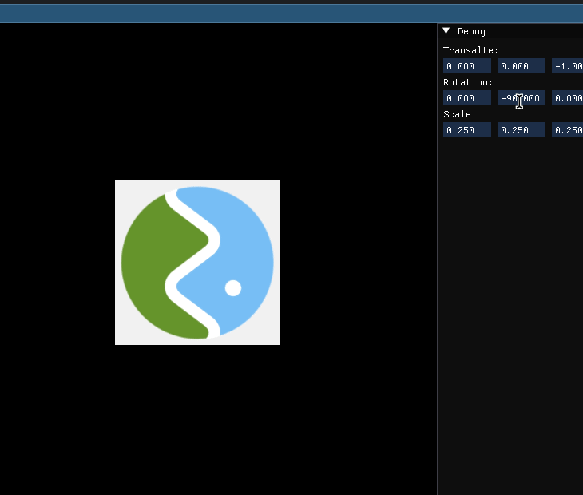

# glTF2 Viewer
opengl glfw2 viewer, its good enough

# Quick start
- u will need opengl, glfw3
```
    $ make
```

# Credits
- [jsoncpp](https://github.com/open-source-parsers/jsoncpp)


# Features
- loading models with one node (only tested for one node)
- 3d transformations
- diffuse lighting
- texture mapping
- auto generate normals if not provided (cross product)

# Todo features
- continue with [gltf2 github](https://github.com/KhronosGroup/glTF-Sample-Models/tree/main/2.0)
- use other textures to give more depth, somthing related to pbr
- fix the normal mapping texture, looks like its compressed [maybe DXT5nm?](https://catlikecoding.com/unity/tutorials/rendering/part-6/)
- implement camera system and use the camera info provided by gltf file


# Showcase

## Transformations and lighting
      

## Texture mapping
     
     
     


